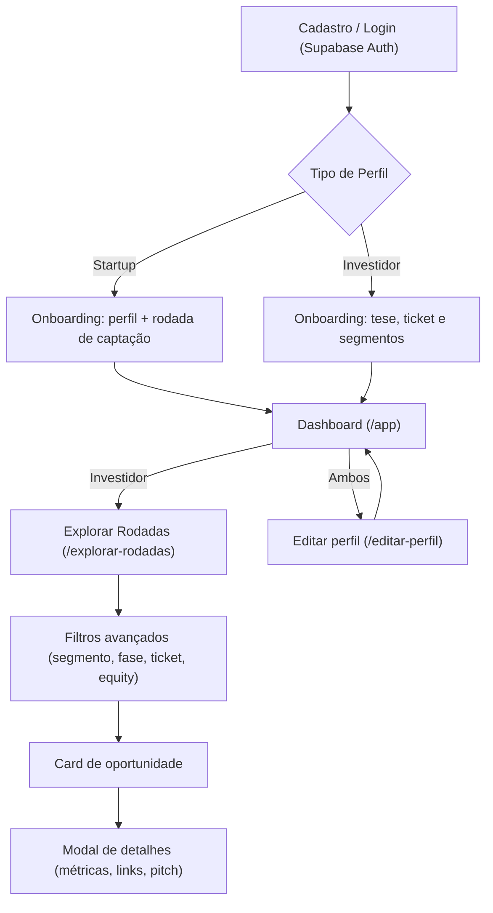
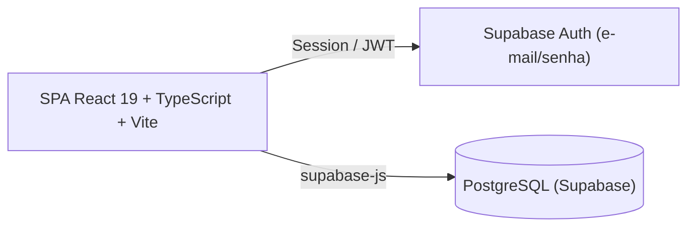

<p align="center">
  
</p>

<h1 align="center">NEXO</h1>

<p align="center">
  <strong>Plataforma Inteligente de Matchmaking entre Startups e Investidores</strong><br>
  <em>Projeto Integrador 2026.2 • UE: FullStack • Senac</em>
</p>

<p align="center">
  
  
  
  
  
  
  
</p>

---

## 📌 Sumário

- [Visão Geral](#-visão-geral)
- [Proposta de Valor e Público-Alvo](#-proposta-de-valor-e-público-alvo)
- [Funcionalidades Atuais](#-funcionalidades-atuais)
- [Fluxo Principal da Solução](#-fluxo-principal-da-solução)
- [Rotas da Aplicação](#-rotas-da-aplicação)
- [Arquitetura e Tecnologias](#-arquitetura-e-tecnologias)
- [Modelo de Dados](#-modelo-de-dados)
- [Estrutura do Repositório](#-estrutura-do-repositório)
- [Governança e Conformidade LGPD](#-governança-e-conformidade-lgpd)
- [Como Executar o Projeto](#-como-executar-o-projeto)
- [Equipe](#-equipe)

---

## 💡 Visão Geral

O **NEXO** é uma plataforma web responsiva que conecta **startups em busca de captação** a **investidores com teses alinhadas**.

Por meio de perfis estruturados (segmento, fase, ticket, localização, links e vídeo de pitch), filtros avançados e um catálogo de rodadas abertas, a plataforma reduz o atrito e o tempo de busca no ecossistema de inovação.

O frontend é uma **SPA em React 19 + TypeScript** com roteamento próprio (History API), e a persistência **já está integrada ao Supabase** (autenticação + banco PostgreSQL), substituindo os dados simulados das primeiras entregas.

---

## 🎯 Proposta de Valor e Público-Alvo

### Proposta de Valor
* **Para Startups:** Visibilidade qualificada para investidores-anjo e fundos, apresentação padronizada de métricas (rodada, equity, fase) e redução do tempo de captação.
* **Para Investidores:** Curadoria e filtragem de *dealflow* por segmento (principal e secundários), fase, faixa de ticket e equity mínimo.

### Público-Alvo
1. **Startups & Empreendedores:** negócios em fases de *Ideação, MVP, Tração ou Escala* em busca de *smart money*.
2. **Investidores & Fundos:** investidores-anjo, *family offices*, corporativos e fundos de *Venture Capital (VC)*.

---

## ✅ Funcionalidades Atuais

### Landing Page
- **Hero** com vídeo de destaque e cartão de prévia de rodada.
- **Como funciona** (jornada em 3 passos), **Trilhas por público** (startup/investidor), **Segmentos** suportados, **FAQ** e **CTA final**.
- Cabeçalho responsivo com navegação e menu mobile.

### Autenticação (Supabase Auth)
- **Cadastro** e **Login** por e-mail/senha, com seleção de papel (**Startup** ou **Investidor**) no cadastro.
- Confirmação de e-mail, tradução de erros de autenticação para PT-BR e *redirect* para `/login` após confirmação.
- Sessão persistida e reidratada automaticamente; eventos de `onAuthStateChange` sincronizados.

### Onboarding
- Formulário de perfil específico por papel, com validação via **Zod**:
  - **Startup:** responsável, nome, **CNPJ** (validação de dígitos verificadores), fase, segmento principal, **segmentos secundários (opcional)**, descrição, vídeo de pitch (URL do YouTube), fundação, site, LinkedIn, **localização por geolocalização** (cidade/estado) e **rodada de captação** (meta, captado, equity, status).
  - **Investidor:** nome, **CPF** (validação), tipo, biografia, faixa de ticket (mín./máx.) e segmentos de interesse.
- **Rascunho automático** dos formulários em `localStorage` (por usuário e tipo).

### Perfil & Dashboard
- **Editar perfil** (`/editar-perfil`) para ambos os papéis, reaproveitando o mesmo motor de validação/persistência do onboarding.
- **Dashboard** (`/app`) com visão geral adaptada ao papel (rodadas/captação para startup; conexões/investimentos/startups para investidor) e ações rápidas.
- **Prévia de perfil** (`StartupProfilePreview` / `InvestorProfilePreview`) mostrando exatamente como o perfil é exibido para o outro lado.

### Explorar Rodadas (Investidor)
- Listagem de **rodadas abertas** carregadas do Supabase (tabela `captacao`).
- **Filtros avançados** em painel dedicado: busca por nome, segmento, fase, faixa de ticket (RangeSlider) e equity mínimo, com botão **Limpar filtros** que se habilita só quando há filtro ativo.
- **Cards de oportunidade** padronizados (segmento com ícone, fase, status, meta, equity, progresso e match).
- **Modal de detalhes** com sobre a startup, **segmentos secundários** (com ícones), informações adicionais (localização, site, LinkedIn) e **vídeo de pitch** (embed do YouTube).

### Utilidades transversais
- Validação e máscara de **CPF/CNPJ** (`utils/documentos.ts`).
- Validação de **URLs** (YouTube, site e LinkedIn) (`utils/videos.ts`).
- **Geocodificação reversa** via Nominatim/OpenStreetMap para preencher cidade/estado (`utils/localizacao.ts`).
- **Ícones por segmento** (`SegmentIcon`), **RangeSlider** acessível e componentes de UI reutilizáveis.

---

## 🔄 Fluxo Principal da Solução



---

## 🧭 Rotas da Aplicação

O roteamento é feito no cliente (History API) em `src/App.tsx`, com proteção de rotas por status de autenticação.

| Rota | Página | Acesso |
| :--- | :--- | :--- |
| `/` | Landing page | Público |
| `/login` | Login | Público (redireciona se já logado) |
| `/cadastro` | Cadastro (papel via `?tipo=`) | Público |
| `/cadastro/startup` | Cadastro de Startup | Público |
| `/cadastro/investidor` | Cadastro de Investidor | Público |
| `/onboarding` | Onboarding de perfil | Autenticado (sem perfil) |
| `/app` | Dashboard | Autenticado |
| `/editar-perfil` | Editar perfil | Autenticado |
| `/explorar-rodadas` | Explorar rodadas | Autenticado (investidor) |

**Estados de autenticação:** `loading` → `signedOut` → `needsProfile` → `ready`. Rotas protegidas exigem `ready`; usuários sem perfil são enviados ao `/onboarding`.

---

## 🛠 Arquitetura e Tecnologias



### Stack Tecnológica
* **Frontend:** [React 19](https://react.dev/), [TypeScript](https://www.typescriptlang.org/), [Vite 6](https://vite.dev/), [Tailwind CSS 4](https://tailwindcss.com/) + CSS customizado.
* **Backend/BaaS:** [Supabase](https://supabase.com/) (Auth + PostgreSQL + RLS), consumo via `@supabase/supabase-js`.
* **Validação:** [Zod 4](https://zod.dev/) nos formulários de perfil.
* **Ícones:** [lucide-react](https://lucide.dev/) + SVGs próprios.
* **Tipografia:** `@fontsource-variable` (Inter e Plus Jakarta Sans).
* **Seed de dados:** `@faker-js/faker` + script `src/seed.ts` (executado com `tsx`).
* **Migrations:** SQL versionado em `supabase/migrations/`.

---

## 🗄 Modelo de Dados

Tabelas principais (Supabase/PostgreSQL):

| Tabela | Descrição |
| :--- | :--- |
| `usuario` | Usuário base (nome, tipo `startup`/`investidor`, ativo). Populado pelo trigger `handle_new_user`. |
| `startup` | Perfil da startup: segmento principal, CNPJ, fase, descrição, vídeo de pitch, fundação, site, LinkedIn, cidade/estado e coordenadas. |
| `investidor` | Perfil do investidor: CPF, tipo, biografia, `ticket_min`, `ticket_max` e LinkedIn. |
| `segmento` | Catálogo de segmentos (Finanças, Saúde, Educação, etc.). |
| `startup_segmento` | **Segmentos secundários** de uma startup (N:N, além do segmento principal). |
| `investidor_segmento` | Segmentos de interesse de um investidor (N:N). |
| `captacao` | Rodada de captação: `valor_alvo`, `valor_captado`, `percentual_equity_oferecido`, `status`, `data_inicio`. |

Migrations disponíveis em `supabase/migrations/`:
`video_pitch_url`, `founded_at`, `site_location`, `split_location`, `secondary_segments`, `limit_equity_offer`, `prevent_future_founding_date`, visibilidade de LinkedIn e ajustes de RLS.

---

## 📂 Estrutura do Repositório

```text
nexo/
├── public/                     # Assets estáticos (favicon, imagem genérica, robots)
├── src/
│   ├── assets/                 # Imagens, vídeos e SVGs
│   ├── auth/                   # AuthContext, AuthProvider, authApi e hook useAuth
│   ├── components/             # Componentes de UI e páginas
│   │   ├── AuthPage.tsx            # Login e cadastro
│   │   ├── OnboardingPage.tsx      # Onboarding de perfil
│   │   ├── EditProfilePage.tsx     # Edição de perfil
│   │   ├── AppPlaceholder.tsx      # Dashboard principal
│   │   ├── ExplorarRodadasPage.tsx # Catálogo de rodadas + filtros + modal
│   │   ├── StartupProfilePreview.tsx / InvestorProfilePreview.tsx
│   │   ├── Hero / HowItWorks / AudiencePaths / Segments / Faq / FinalCta / Header / Footer
│   │   ├── SegmentIcon.tsx         # Ícone por segmento
│   │   └── RangeSlider.tsx         # Slider de faixa (ticket)
│   ├── data/                   # Dados e tipos da landing/perfil
│   ├── lib/                    # supabase.ts e perfilApi.ts (acesso a dados)
│   ├── utils/                  # documentos, localizacao, videos, perfilDraft
│   ├── seed.ts                 # Script de seed (npm run seed)
│   ├── App.tsx                 # Roteamento e proteção de rotas
│   ├── index.css               # Tailwind + design system global
│   └── main.tsx                # Entrada do React
├── supabase/migrations/        # Migrations SQL versionadas
├── .env.example                # Modelo de variáveis de ambiente
├── vite.config.ts
└── README.md
```

---

## ⚖ Governança e Conformidade LGPD

O projeto adota princípios de privacidade desde a concepção (*Privacy by Design*), de acordo com a **Lei Geral de Proteção de Dados (Lei nº 13.709/2018)**:

### 1. Dados Pessoais Tratados
* **Identificação e Contato:** nome, e-mail e vínculo institucional.
* **Dados do Negócio:** CNPJ/CPF, estágio, tese, faixas financeiras declaradas, métricas da rodada de captação e localização aproximada (cidade/estado).

### 2. Segurança e Direitos
* **Autenticação:** gerenciada pelo Supabase Auth, com senhas jamais expostas ao cliente e confirmação de e-mail.
* **Controle de Acesso:** **Row Level Security (RLS)** nas tabelas, garantindo que cada usuário só acesse o que lhe pertence.
* **Finalidade e Minimização:** coleta estrita dos dados necessários para o matchmaking.
* **Direitos do Titular:** edição e exclusão dos dados cadastrais via perfil, com base legal documentada.

---

## 💻 Como Executar o Projeto

### Pré-requisitos
* [Node.js](https://nodejs.org/) (versão 20.x ou superior recomendada)
* `npm`
* Um projeto no [Supabase](https://supabase.com/) com as migrations aplicadas

### Passo a Passo
```bash
# 1. Clonar o repositório
git clone https://github.com/kiellzz/nexo.git
cd nexo_p.i_2026.2

# 2. Instalar as dependências
npm install

# 3. Configurar variáveis de ambiente (.env)
#    VITE_SUPABASE_URL=...
#    VITE_SUPABASE_ANON_KEY=...

# 4. (Opcional) Popular o banco com dados de exemplo
npm run seed

# 5. Iniciar o servidor de desenvolvimento
npm run dev
```

Acesse no navegador: `http://localhost:5173`.

### Scripts disponíveis
| Script | Descrição |
| :--- | :--- |
| `npm run dev` | Sobe o servidor de desenvolvimento (Vite). |
| `npm run build` | Checagem de tipos (`tsc -b`) + build de produção. |
| `npm run preview` | Pré-visualiza o build de produção. |
| `npm run seed` | Popula o Supabase com startups, investidores e rodadas de exemplo. |

---

## 👥 Equipe

* **Pedro Henrique Maciel**
* **Hugo Dantas**
* **Roberto Alves**
* **Cleybson Teixeira**
* **Ezequiel Borges**
* **Eduardo Soares**

*Orientação: Prof. Geraldo Gomes*

---

<p align="center">
  Desenvolvido com 💙 pelo time <strong>NEXO</strong>
</p>