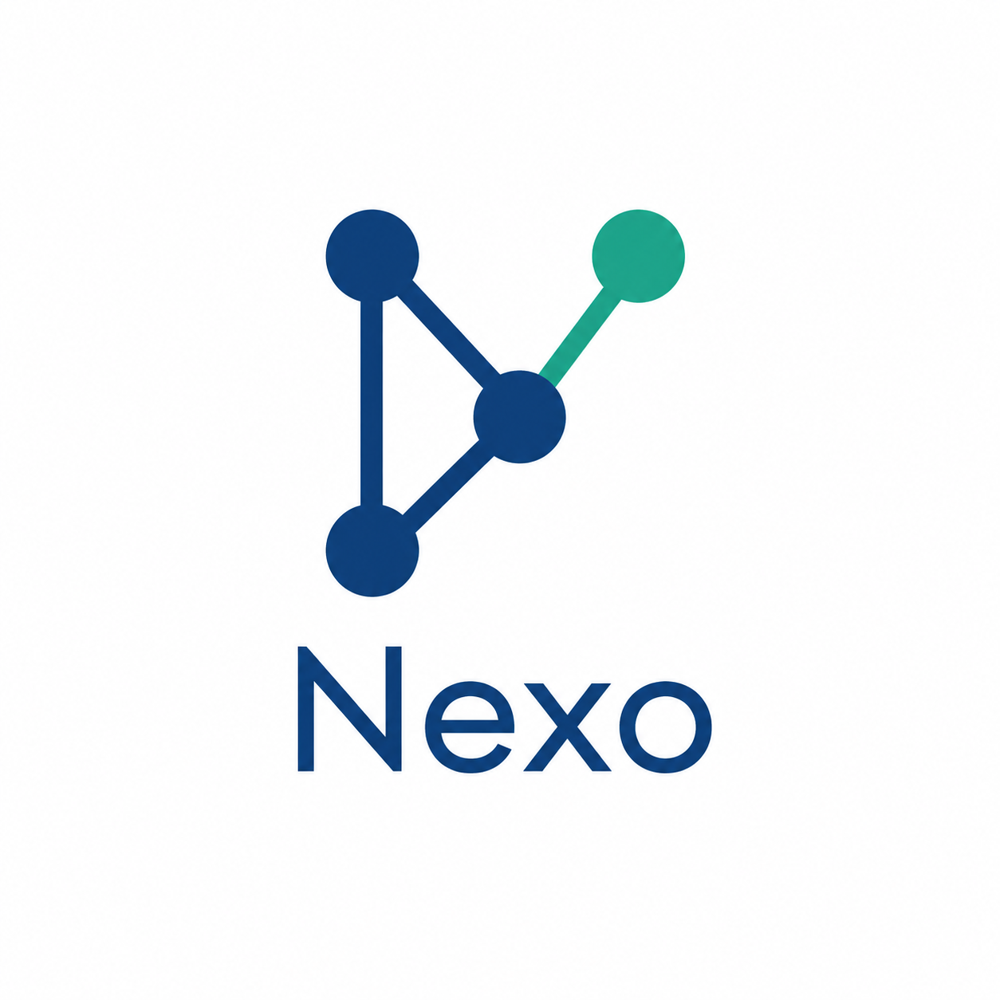
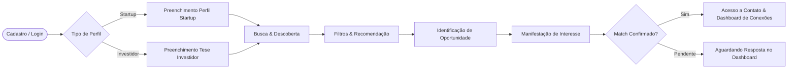
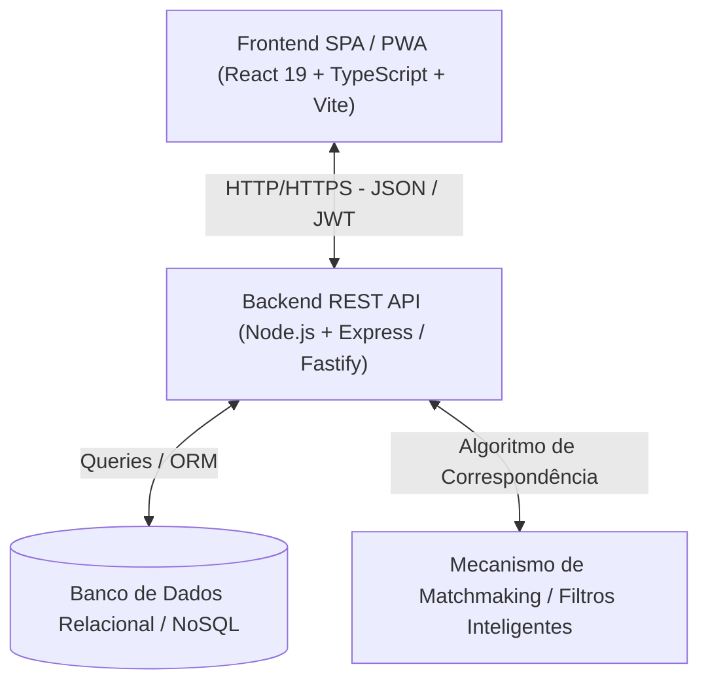

<p align="center">
  
</p>

<h1 align="center">NEXO</h1>

<p align="center">
  <strong>Plataforma Inteligente de Matchmaking entre Startups e Investidores</strong><br>
  <em>Projeto Integrador 2026.2 • UE: FullStack • Senac</em>
</p>

<p align="center">
  
  
  
  
  
  
</p>

---

## 📌 Sumário

- [Visão Geral](#-visão-geral)
- [Proposta de Valor e Público-Alvo](#-proposta-de-valor-e-público-alvo)
- [Escopo da 1ª Entrega (MVP)](#-escopo-da-1ª-entrega-mvp)
- [Fluxo Principal da Solução](#-fluxo-principal-da-solução)
- [Arquitetura e Tecnologias](#-arquitetura-e-tecnologias)
- [Documentação das APIs (REST)](#-documentação-das-apis-rest)
- [Business Model Canvas Inicial](#-business-model-canvas-inicial)
- [Governança e Conformidade LGPD](#-governança-e-conformidade-lgpd)
- [Estrutura do Projeto](#-estrutura-do-projeto)
- [Como Executar o Projeto](#-como-executar-o-projeto)
- [Equipe](#-equipe)

---

## 💡 Visão Geral

O **NEXO** é uma plataforma web responsiva e PWA desenvolvida para conectar e aproximar **startups em busca de captação e crescimento** a **investidores em busca de oportunidades alinhadas com suas teses de investimento**. 

Por meio de perfis estruturados, filtros avançados e algoritmos de recomendação/matchmaking inteligente, o sistema reduz o atrito e o tempo de busca no ecossistema de inovação, promovendo conexões assertivas e transparentes.

---

## 🎯 Proposta de Valor e Público-Alvo

### Proposta de Valor
* **Para Startups:** Visibilidade qualificada para fundos e investidores anjo, métricas padronizadas de apresentação do negócio e redução de tempo na busca por captação.
* **Para Investidores:** Curadoria e filtragem assertiva de dealflow baseada em tese de investimento, estágio de desenvolvimento, segmento e ticket médio.

### Público-Alvo
1. **Empreendedores & Startups:** Negócios em fases de validação, MVP, tração ou escala que buscam capital inteligente (*smart money*).
2. **Investidores & Fundos:** Investidores-anjo, sindicatos de investimento, aceleradoras e fundos de *Venture Capital (VC)*.

---

## 🚀 Escopo da 1ª Entrega (MVP)

A 1ª Entrega do projeto contempla a integração completa de **Frontend, Backend, Banco de Dados e Governança**:

* [x] **Aplicação Web Responsiva / PWA Funcional:** Interface moderna otimizada para múltiplos dispositivos.
* [x] **Autenticação e Sessão:** Cadastro, login e controle de acesso com diferenciação de perfis (**Startup** vs. **Investidor**).
* [x] **Perfil de Startups:** Cadastro detalhado contendo segmento, estágio de desenvolvimento, localização, equipe, mercado de atuação e investimento pretendido.
* [x] **Perfil de Investidores:** Cadastro detalhado contendo áreas de interesse, tese de investimento, faixa/ticket de investimento e localização.
* [x] **Mecanismo de Busca e Filtros:** Localização dinâmica de oportunidades por filtros categóricos e critérios de negócio.
* [x] **Matchmaking & Registro de Interesse:** Fluxo de identificação mútua de oportunidades com registro de manifestação de interesse (*match*).
* [x] **Dashboard Personalizado:** Painel inicial apresentando oportunidades recomendadas, métricas e conexões ativas.
* [x] **Arquitetura Cliente-Servidor & API REST:** Comunicação estruturada, documentada e desacoplada.
* [x] **Modelo de Governança & LGPD:** Mapeamento de dados pessoais tratados e definição preliminar das regras de uso da plataforma.

---

## 🔄 Fluxo Principal da Solução

O fluxo central do MVP demonstra a jornada completa do usuário na plataforma:



---

## 🛠 Arquitetura e Tecnologias

A solução adota uma arquitetura cliente-servidor desacoplada com comunicação via **API REST**:



### Tecnologias Utilizadas
* **Frontend:** [React](https://react.dev/), [TypeScript](https://www.typescriptlang.org/), [Vite](https://vite.dev/), PWA, CSS Moderno / Tailwind.
* **Backend:** [Node.js](https://nodejs.org/), Express / Fastify, RESTful Architecture.
* **Linter & Ferramentas:** [Oxlint](https://oxc-project.github.io/), Git / GitHub.
* **Segurança:** Autenticação via Tokens (JWT), criptografia de senhas (bcrypt).

---

## 🔌 Documentação das APIs (REST)

| Método | Endpoint | Descrição | Acesso |
| :--- | :--- | :--- | :--- |
| `POST` | `/api/auth/register` | Cadastro de novos usuários (Startup/Investidor) | Público |
| `POST` | `/api/auth/login` | Autenticação e geração de token | Público |
| `GET` | `/api/startups` | Listagem e busca de startups com filtros | Autenticado |
| `GET` | `/api/startups/:id` | Detalhes do perfil da startup | Autenticado |
| `PUT` | `/api/startups/profile` | Atualização do perfil da startup logada | Startup |
| `GET` | `/api/investors` | Listagem e busca de investidores com filtros | Autenticado |
| `PUT` | `/api/investors/profile` | Atualização da tese do investidor logado | Investidor |
| `POST` | `/api/matches/interest` | Registrar manifestação de interesse | Autenticado |
| `GET` | `/api/matches/dashboard` | Listar matches e oportunidades recomendadas | Autenticado |

---

## 📊 Business Model Canvas Inicial

```
┌────────────────────────┬────────────────────────┬────────────────────────┬────────────────────────┬────────────────────────┐
│ PARCERIAS-CHAVE        │ ATIVIDADES-CHAVE       │ PROPOSTA DE VALOR      │ RELACIONAMENTO         │ SEGMENTOS DE CLIENTES  │
│ • Aceleradoras e Hubs  │ • Desenvolvimento contínuo│ • Matchmaking ágil e │ • Suporte na plataforma│ • Startups (Early/     │
│   de Inovação          │   do algoritmo de match│   assertivo baseado em │ • Transparência de     │   Growth Stage)        │
│ • Faculdades e Polos   │ • Moderação de perfis e│   dados estruturados   │   métricas e feedbacks │ • Investidores-anjo,   │
│ • Associações de Anjos │   curadoria de dados   │ • Redução de ruído na  │                        │   Family Offices e     │
│                        │ • Segurança e LGPD     │   busca por capital    │ CANAIS                 │   Fundos de VC         │
├────────────────────────┼────────────────────────┤                        ├────────────────────────┤                        │
│ RECURSOS-CHAVE         │                        │                        │ • Plataforma Web e PWA │                        │
│ • Plataforma Tecnológica                        │                        │ • Parcerias com Polos  │                        │
│ • Base de dados de startups e investidores     │                        │   Tecnológicos         │                        │
├────────────────────────┴────────────────────────┴────────────────────────┴────────────────────────┴────────────────────────┤
│ ESTRUTURA DE CUSTOS                                                      │ FONTES DE RECEITA                                      │
│ • Infraestrutura de nuvem, servidores e banco de dados                   │ • Modelo Freemium com planos Premium para destaque     │
│ • Desenvolvimento, manutenção e segurança da informação                 │ • Taxa de sucesso / Conexões avançadas de dealflow     │
└──────────────────────────────────────────────────────────────────────────┴────────────────────────────────────────────────────────┘
```

---

## ⚖ Governança e Conformidade LGPD

O projeto é estruturado em conformidade com as diretrizes da **Lei Geral de Proteção de Dados (Lei nº 13.709/2018)**:

### 1. Dados Pessoais Tratados
* **Identificação e Contato:** Nome, e-mail, telefone, cargo e dados corporativos/institucionais.
* **Dados de Negócio:** Informações financeiras declaradas, segmento e faturamento (tratados com consentimento explícito e níveis de visibilidade configuráveis).

### 2. Princípios e Segurança
* **Finalidade e Necessidade:** Coleta apenas dos dados estritamente necessários para a operação de matchmaking.
* **Segurança e Confidencialidade:** Armazenamento seguro de senhas com *hash*, comunicação cifrada via HTTPS e controle restrito de acesso aos dados sensíveis.
* **Direitos dos Titulares:** Mecanismos para visualização, alteração e solicitação de exclusão de dados da conta.

### 3. Regras de Uso da Plataforma
* Veracidade obrigatória nas informações de captação e métricas financeiras.
* Proibição de condutas abusivas, envio de spam ou uso indevido de contatos corporativos obtidos via plataforma.

---

## 📂 Estrutura do Projeto

```text
nexo/
├── app/                    # Frontend da aplicação (React + Vite + TypeScript)
│   ├── public/             # Arquivos públicos e assets estáticos
│   ├── src/                # Código-fonte da interface
│   │   ├── assets/         # Imagens, ícones e recursos visuais
│   │   ├── components/     # Componentes reutilizáveis
│   │   ├── pages/          # Páginas (Login, Cadastro, Dashboard, Busca, Perfil)
│   │   ├── services/       # Integração com API REST
│   │   ├── App.tsx         # Componente raiz
│   │   └── main.tsx        # Ponto de entrada do React
│   ├── package.json        # Dependências e scripts do frontend
│   └── vite.config.ts      # Configurações do Vite
├── nexo_logo.png           # Logotipo oficial da aplicação
└── README.md               # Documentação principal do repositório
```

---

## 💻 Como Executar o Projeto

### Pré-requisitos
* [Node.js](https://nodejs.org/) (versão 20.x ou superior recomendada)
* Gerenciador de pacotes `npm` ou `yarn`

### 1. Clonar o Repositório
```bash
git clone https://github.com/Pedro-Maciel77/nexo.git
cd nexo
```

### 2. Executar o Frontend
```bash
# Acessar a pasta da aplicação
cd app

# Instalar as dependências
npm install

# Iniciar o servidor de desenvolvimento
npm run dev
```

A aplicação estará disponível em `http://localhost:5173`.

---

## 👥 Equipe

* **Pedro Henrique Maciel** ([@Pedro-Maciel77](https://github.com/Pedro-Maciel77))
* **Hugo Dantas**
* **Roberto Alves**
* **Cleybson Teixeira**
* **Ezequiel Borges**
* **Eduardo Soares**

*Orientação: Prof. Geraldo Gomes*

---

<p align="center">
  Desenvolvido com 💙 pelo time <strong>NEXO</strong>
</p>
