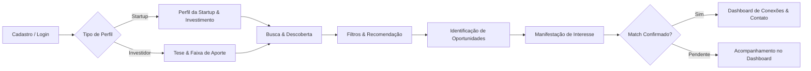
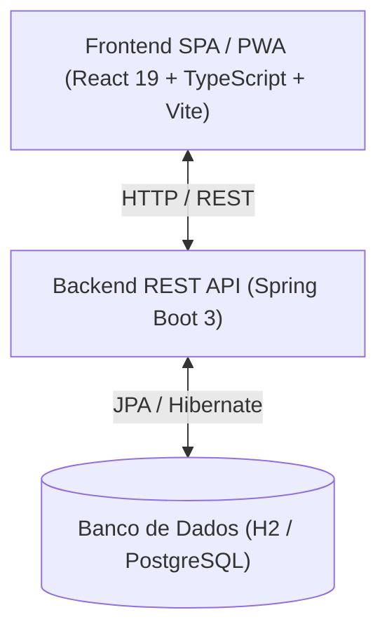

<p align="center">
  
</p>

<h1 align="center">NEXO</h1>

<p align="center">
  <strong>Plataforma Inteligente de Matchmaking entre Startups e Investidores</strong><br>
  <em>Projeto Integrador 2026.2 • UE: FullStack • Senac</em>
</p>

<p align="center">
  
  
  
  
  
  
  <a href="https://trello.com/b/H6sAjFhC/pi-nexo" target="_blank">
    
  </a>
</p>
</p>

---

## 📌 Sumário

- [Visão Geral](#-visão-geral)
- [Proposta de Valor e Público-Alvo](#-proposta-de-valor-e-público-alvo)
- [Status de Desenvolvimento do MVP](#-status-de-desenvolvimento-do-mvp)
- [Fluxo Principal da Solução](#-fluxo-principal-da-solução)
- [Arquitetura e Tecnologias](#-arquitetura-e-tecnologias)
- [Business Model Canvas Inicial](#-business-model-canvas-inicial)
- [Governança e Conformidade LGPD](#-governança-e-conformidade-lgpd)
- [Estrutura Atual do Repositório](#-estrutura-atual-do-repositório)
- [Como Executar o Projeto](#-como-executar-o-projeto)
- [Equipe](#-equipe)

---

## 💡 Visão Geral

O **NEXO** é uma plataforma web responsiva e PWA projetada para conectar e aproximar **startups em busca de captação e crescimento** a **investidores com teses alinhadas**.

Por meio de perfis estruturados, filtros detalhados e mecanismos de correspondência inteligente (*matchmaking*), a plataforma reduz o atrito e o tempo de busca no ecossistema de inovação, proporcionando conexões assertivas e qualificadas.

---

## 🎯 Proposta de Valor e Público-Alvo

### Proposta de Valor
* **Para Startups:** Visibilidade qualificada para investidores-anjo e fundos, apresentação padronizada de métricas e redução do tempo de captação.
* **Para Investidores:** Curadoria e filtragem de dealflow com base em critérios de tese, estágio de maturidade, segmento e ticket médio.

### Público-Alvo
1. **Startups & Empreendedores:** Negócios em fases de validação, MVP, tração ou escala em busca de investimento inteligente (*smart money*).
2. **Investidores & Fundos:** Investidores-anjo, sindicatos de investimento, aceleradoras e fundos de *Venture Capital (VC)*.

---

## 🚀 Status de Desenvolvimento do MVP (1ª Entrega)

| Módulo / Requisito | Status Atual | Detalhes |
| :--- | :---: | :--- |
| **Interface Web Responsiva / PWA** | `Concluído` | Interface moderna em React 19 + TypeScript rodando com Vite |
| **Autenticação & Perfis (Startup / Investidor)** | `Concluído (UI)` | Telas e alternância de papéis implementadas no frontend |
| **Catálogo de Startups & Investidores** | `Concluído (UI)` | Visualização de cards, métricas e teses com dados simulados |
| **Mecanismo de Filtros & Oportunidades** | `Concluído (UI)` | Filtros dinâmicos por segmento, ticket e estágio no frontend |
| **Fluxo de Matchmaking & Interesse** | `Concluído (UI)` | Simulação visual de registro de interesse e status de match |
| **Dashboard de Oportunidades** | `Concluído (UI)` | Painéis e métricas renderizados no cliente |
| **Backend REST API (Spring Boot 3)** | `Concluído` | API REST com 5 endpoints CRUD, Swagger UI, H2/PostgreSQL |
| **Banco de Dados** | `Concluído` | H2 em memória (testes) + PostgreSQL configurado |

---

## 🔄 Fluxo Principal da Solução

O fluxo da plataforma contempla toda a jornada do usuário, desde a entrada até a conexão mútua:



---

## 🛠 Arquitetura e Tecnologias

A arquitetura do projeto foi desenhada seguindo o modelo **cliente-servidor desacoplado**:



### Stack Tecnológica
* **Frontend:** [React 19](https://react.dev/), [TypeScript](https://www.typescriptlang.org/), [Vite](https://vite.dev/), PWA e CSS moderno.
* **Backend:** [Spring Boot 3.3.5](https://spring.io/projects/spring-boot), Java 17+, API RESTful com Spring Data JPA.
* **Banco de Dados:** [H2](https://www.h2database.com) (em memória) + [PostgreSQL](https://www.postgresql.org/).
* **Documentação:** [Springdoc OpenAPI](https://springdoc.org) v2.6.0 (Swagger UI).
* **Linter & Qualidade de Código:** [Oxlint](https://oxc-project.github.io/), Git e GitHub.

---

## 📊 Business Model Canvas Inicial

```
┌────────────────────────┬────────────────────────┬────────────────────────┬────────────────────────┬────────────────────────┐
│ PARCERIAS-CHAVE        │ ATIVIDADES-CHAVE       │ PROPOSTA DE VALOR      │ RELACIONAMENTO         │ SEGMENTOS DE CLIENTES  │
│ • Aceleradoras e Hubs  │ • Desenvolvimento contínuo│ • Matchmaking ágil e │ • Suporte na plataforma│ • Startups (Early/     │
│   de Inovação          │   do algoritmo de match│   assertivo baseado em │ • Transparência de     │   Growth Stage)        │
│ • Faculdades e Polos   │ • Moderação de perfis e│   dados estruturados   │   métricas e feedbacks │ • Investidores-anjo,   │
│ • Associações de Anjos │   curadoria de dados   │ • Redução de ruído na  │                        │   Family Offices e     │
│                        │ • Segurança e LGPD     │   busca por capital    │ CANAIS                 │   Fundos de VC         │
├────────────────────────┼────────────────────────┤                        ├────────────────────────┤                        │
│ RECURSOS-CHAVE         │                        │                        │ • Plataforma Web e PWA │                        │
│ • Plataforma Tecnológica                        │                        │ • Parcerias com Polos  │                        │
│ • Base de dados de startups e investidores     │                        │   Tecnológicos         │                        │
├────────────────────────┴────────────────────────┴────────────────────────┴────────────────────────┴────────────────────────┤
│ ESTRUTURA DE CUSTOS                                                      │ FONTES DE RECEITA                                      │
│ • Infraestrutura de nuvem, servidores e banco de dados                   │ • Modelo Freemium com planos Premium para destaque     │
│ • Desenvolvimento, manutenção e segurança da informação                 │ • Taxa de sucesso / Conexões avançadas de dealflow     │
└──────────────────────────────────────────────────────────────────────────┴────────────────────────────────────────────────────────┘
```

---

## ⚖ Governança e Conformidade LGPD

O projeto adota princípios de privacidade desde a concepção (*Privacy by Design*), de acordo com a **Lei Geral de Proteção de Dados (Lei nº 13.709/2018)**:

### 1. Dados Pessoais Tratados
* **Identificação e Contato:** Nome, e-mail, telefone, cargo e vínculo institucional.
* **Dados do Negócio:** Estágio, tese, faixas financeiras declaradas e métricas corporativas (sob consentimento e controle de visibilidade do usuário).

### 2. Segurança e Direitos
* **Finalidade e Minimização:** Coleta estrita dos dados necessários para a operação do matchmaking.
* **Segurança da Informação:** Proteção de senhas com *hash*, comunicação cifrada via HTTPS e controle restrito de acesso.
* **Direitos do Titular:** Garantia de visualização, retificação e solicitação de exclusão dos dados cadastrais.

---

## 📂 Estrutura Atual do Repositório

```text
nexo/
├── app/                    # Frontend da aplicação (React + Vite + TypeScript)
│   ├── public/             # Arquivos públicos e assets estáticos
│   ├── src/                # Código-fonte da interface
│   │   ├── assets/         # Imagens e recursos visuais
│   │   ├── App.css         # Estilos da aplicação
│   │   ├── App.tsx         # Componente principal com as telas do MVP
│   │   ├── index.css       # Estilos globais
│   │   └── main.tsx        # Ponto de entrada do React
│   ├── package.json        # Dependências e scripts do frontend
│   └── vite.config.ts      # Configuração do Vite
├── backend/                # Backend da aplicação (Spring Boot 3)
│   ├── src/main/
│   │   ├── java/com/nexo/startup/  # Código-fonte Java
│   │   │   ├── controller/         # Controladores REST (5 endpoints)
│   │   │   ├── service/            # Lógica de negócio
│   │   │   ├── repository/         # Repositórios JPA
│   │   │   ├── entity/             # Entidades JPA
│   │   │   ├── dto/                # DTOs de requisição/resposta
│   │   │   ├── mapper/             # Mapeadores
│   │   │   ├── config/             # OpenAPI, CORS
│   │   │   └── exception/          # Handlers de exceção
│   │   └── resources/
│   │       └── application.properties
│   ├── pom.xml                   # Dependências Maven
│   └── README.md                 # Documentação do backend
├── nexo_logo.png                 # Logotipo oficial da plataforma
└── README.md                     # Documentação do projeto
```

---

## 💻 Como Executar o Projeto

### Pré-requisitos
* **JDK 17 ou superior** instalado
* **Maven** instalado
* [Node.js](https://nodejs.org/) (versão 20.x ou superior recomendada) para o frontend
* Gerenciador de pacotes `npm` ou `yarn`

### Passo a Passo

#### 1. Backend (Spring Boot)
```bash
# Acessar a pasta do backend
cd backend

# Iniciar o servidor
mvn spring-boot:run
```

O backend ficará disponível em `http://localhost:8080`.

- **Swagger UI**: [http://localhost:8080/swagger-ui.html](http://localhost:8080/swagger-ui.html)
- **API JSON**: [http://localhost:8080/v3/api-docs](http://localhost:8080/v3/api-docs)

#### 2. Frontend (React)
```bash
# Acessar a pasta do frontend
cd app

# Instalar as dependências
npm install

# Iniciar o servidor de desenvolvimento
npm run dev
```

Acesse no navegador: `http://localhost:5173`.

#### 3. Banco de Dados
- **Padrão**: H2 em memória (já configurado para testes rápidos)
- **Produção**: Configure o PostgreSQL alterando o `src/main/resources/application.properties`:
```properties
spring.datasource.url=jdbc:postgresql://localhost:5432/nexo
spring.datasource.username=postgres
spring.datasource.password=postgres
```
```sql
CREATE DATABASE nexo;
```

---

## 👥 Equipe

* **Pedro Henrique Maciel** ([@Pedro-Maciel77](https://github.com/Pedro-Maciel77))
* **Hugo Dantas**
* **Roberto Alves**
* **Cleybson Teixeira**
* **Ezequiel Borges**
* **Eduardo Soares**

*Orientação: Prof. Geraldo Gomes*

---

<p align="center">
  Desenvolvido com 💙 pelo time <strong>NEXO</strong>
</p>
